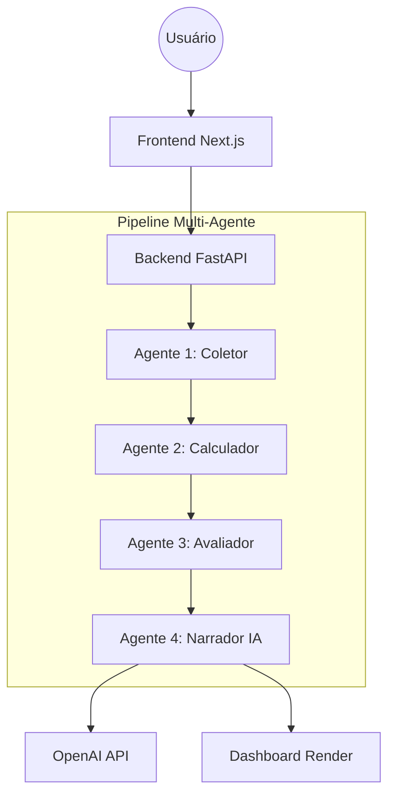

Este é o README.md oficial para o projeto **AI Fundamental Analyst**, estruturado para refletir a maturidade técnica e os padrões de engenharia de software de nível corporativo.

---

# AI Fundamental Analyst 🚀

<p align="center">
  
</p>

### O Copiloto de Inteligência Artificial para Análise Fundamentalista de Ações da B3.

[](https://www.python.org/)
[](https://fastapi.tiangolo.com/)
[](https://nextjs.org/)
[](https://opensource.org/licenses/MIT)
[](https://openai.com/)

---

## 📋 Visão Geral

O **AI Fundamental Analyst** resolve o gap crítico entre dados financeiros brutos e a tomada de decisão consciente. Atualmente, investidores enfrentam dois extremos: plataformas tradicionais repletas de indicadores complexos que exigem profundo conhecimento técnico, ou IAs genéricas que, apesar de fluídas, sofrem com alucinações matemáticas e falta de dados em tempo real.

Este projeto foi criado para ser um **Copiloto de Análise**, transformando o caos de balanços patrimoniais e DREs em diagnósticos compreensíveis, didáticos e, acima de tudo, tecnicamente precisos.

---

## 🧠 Filosofia de Engenharia

> **"Os números vêm do motor determinístico. A interpretação vem da IA."**

Diferente de soluções que delegam cálculos à Inteligência Artificial, nossa arquitetura impõe uma separação rigorosa de responsabilidades (ADR-001). LLMs são excelentes redatores, mas péssimos matemáticos. Por isso, garantimos **100% de precisão matemática** através de um motor em Python, utilizando o LLM exclusivamente para traduzir dados estruturados (JSON) em linguagem natural narrativa.

---

## 🏗️ Arquitetura do Sistema

O sistema utiliza uma arquitetura **Client-Server desacoplada** com comunicação via API REST, otimizada para escalabilidade e manutenção modular.



---

## 🤖 Pipeline de Agentes Especializados

Nossa espinha dorsal é um pipeline sequencial de 4 agentes (ADR-002), garantindo que cada etapa do processamento tenha uma responsabilidade estrita:

1.  **Agente 1 - Coletor:** Realiza o web scraping robusto de dados brutos de fontes como Fundamentus e CVM.
2.  **Agente 2 - Calculador:** Normaliza e transforma dados brutos em indicadores financeiros (ROE, P/L, CAGR).
3.  **Agente 3 - Avaliador:** O "cérebro determinístico". Aplica regras de scoring baseadas em clássicos (Graham, Buffett) para gerar notas de 0 a 10 por categoria.
4.  **Agente 4 - Narrador (IA):** Traduz o JSON estruturado do avaliador em um relatório Markdown completo, evitando qualquer improvisação numérica.

---

## ✨ Principais Funcionalidades

| Funcionalidade | Descrição |
| :--- | :--- |
| **Diagnóstico 360°** | Análise instantânea de Rentabilidade, Valuation, Crescimento, Endividamento e Dividendos. |
| **Score Fundamentalista** | Pontuação de 0 a 100 baseada em pesos estratégicos e lógica matemática pura. |
| **Chat Contextual** | IA que responde perguntas específicas sobre o ticker, baseada estritamente nos dados coletados. |
| **Visualização Premium** | Dashboard com gráficos radiais, barras de saúde animadas e interface responsiva. |

---

## 🛠️ Stack Tecnológica

*   **Backend:** Python 3.11+, FastAPI (Orquestrador), BeautifulSoup4 (Scraping), Pydantic (Validação).
*   **Frontend:** Next.js 14 (App Router), Tailwind CSS, Framer Motion (Animações), Recharts (Gráficos).
*   **IA:** OpenAI GPT-4o-mini (Narrativa e Contexto).
*   **Infraestrutura:** Render (API), Vercel (Frontend), UptimeRobot (Keep-alive).

---

## 📂 Estrutura do Projeto

```text
├── backend/
│   ├── agents/           # Lógica dos 4 agentes especializados
│   ├── main.py           # Endpoints FastAPI e orquestração
│   └── requirements.txt  # Dependências Python
├── frontend/
│   ├── app/              # Next.js App Router e UI
│   ├── components/       # Componentes React (Cards, Chat, Gráficos)
│   └── tailwind.config.js
├── docs/
│   ├── ADR.md            # Architecture Decision Records
│   └── PROJECT_MEMORY.md # Memória de engenharia permanente
└── README.md
```

---

## 🚀 Instalação e Execução Local

### Backend
1. Navegue até `/backend`.
2. Crie um ambiente virtual: `python -m venv venv`.
3. Instale as dependências: `pip install -r requirements.txt`.
4. Configure sua `OPENAI_API_KEY` no arquivo `.env`.
5. Execute: `uvicorn main:app --reload`.

### Frontend
1. Navegue até `/frontend`.
2. Instale os pacotes: `npm install`.
3. Configure `NEXT_PUBLIC_API_URL` apontando para o seu backend local.
4. Execute: `npm run dev`.

---

## 🖼️ Screenshots

<p align="center">
  <em>[Placeholder: Inserir imagem do Dashboard Principal com o Radial Score Chart]</em><br>
  <em>[Placeholder: Inserir imagem do Chat Contextual e Relatório da IA]</em>
</p>

---

## 🗺️ Roadmap de Evolução

- [x] **MVP 1 & 2:** Pipeline Multi-agente e Dashboard funcional.
- [ ] **MVP 3:** Comparação entre empresas (Side-by-side).
- [ ] **MVP 4:** Análise setorial inteligente.
- [ ] **MVP 5:** RAG Documental (Upload de Relatórios de RI e CVM).
- [ ] **MVP 6:** Modo Buffett (Análise qualitativa profunda).

---

## 📐 Engenharia e Qualidade

Este projeto é guiado por uma **Documentação Viva**, garantindo que cada decisão técnica seja rastreável:

*   **[ADR (Architecture Decision Records)](06%20-%20ADR.md%20(Architecture%20Decision%20Records):** Registro formal de decisões como a troca do Yahoo Finance pelo Fundamentus (ADR-007) e o uso de JSON como contrato estrito (ADR-003).
*   **[PROJECT_MEMORY.md](05%20-%20%F0%9F%A7%A0%20PROJECT_MEMORY.md):** Histórico de engenharia, dívidas técnicas e regras que nunca devem ser quebradas (ex: "A IA nunca calcula").

---

## 🤝 Contribuição

Contribuições são bem-vindas! Para grandes mudanças, abra uma *issue* primeiro para discutir o que você gostaria de alterar.
1. Faça um Fork do projeto.
2. Crie uma Branch para sua Feature (`git checkout -b feature/NovaFeature`).
3. Dê Commit em suas mudanças (`git commit -m 'Adicionando nova feature'`).
4. Faça o Push para a Branch (`git push origin feature/NovaFeature`).
5. Abra um Pull Request.

---

## 📄 Licença

Distribuído sob a licença MIT. Veja `LICENSE` para mais informações.

---
**AI Fundamental Analyst** é mais do que um aplicativo; é um estudo sobre arquitetura de software, Inteligência Artificial e engenharia de contexto aplicada ao mercado financeiro.
